<!-- footer: ソフトウェア工学　2018年度版　第1週-->
<!-- page_number: true -->

# 第１週

## [ソフトウェア工学とは](#se11)
## [ソフトウェア開発工程](#se12)
## [ソフトウェア開発モデル](#se13)

---

# 課題

### note_week1.docx または note_week1.md をグループで分担して作成して Bb9 を通じて提出せよ．

- OneDriveを利用したOfficeの共同編集 https://www.microsoft.com/ja-jp/office/homeuse/scenario/onedrive07.aspx
- Marp: Markdown presentation writer (https://yhatt.github.io/marp/)

---

# 第１週

## [<span style="color: red;">ソフトウェア工学とは</span>](#se11)
## [ソフトウェア開発工程](#se12)
## [ソフトウェア開発モデル](#se13)

---

<a name="se11"></a>
# ソフトウェア工学とは

### ソフトウェア工学誕生までの歴史
### ソフトウェア工学の必要性
### ソフトウェア工学の範囲

---

# ソフトウェア工学誕生までの歴史

- 1942〜46 コンピュータの軍事利用（暗号解読，弾道計算，リレーによるプログラミング）
- 1949 プログラム内蔵方式（EDSAC）
- 1953〜54 基本ソフトウェア
- 1955 FORTRAN　
- 1960 ALGOL, COBOL, LISP　
- 1964 IBM System/360 (OS/360)　
- 1968 NATO の国際会議「ソフトウェア工学」

---

# ソフトウェア危機とソフトウェア工学

## ソフトウェア危機

- 汎用化によりハードウェアよりもソフトウェアを重視
- ソフトウェア開発需要の増加と技術者の不足
	- 予定期間・コストの超過
	- 品質の低いソフトウェア

## ソフトウェア工学

- ソフトウェアを工業製品として設計・開発する技術
- 定義 (IEEE Std 610-1990)
	- ソフトウェアの開発，運用，保守に対する，系統的で統制され定量化可能な方法．すなわちソフトウェアへの工学の適用．
	- 上記のような方法の研究．

---

# ソフトウェア開発体制

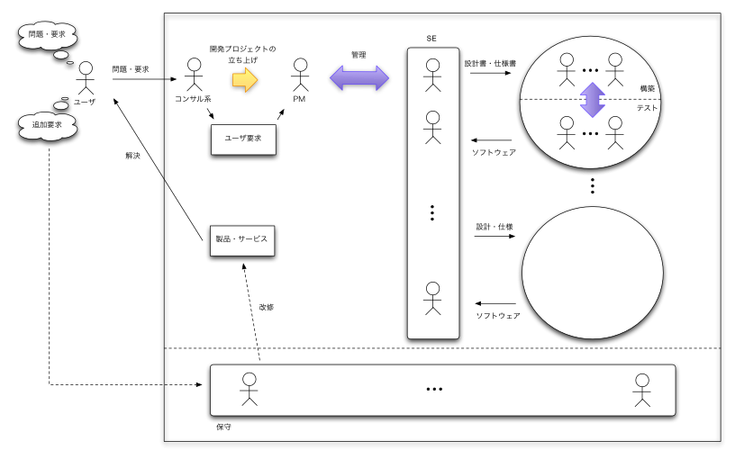

---

# なにが難しいのか？

- Frederick P. Brooks の分析（IBM OS/360 の開発者）
- OS/360 開発プロジェクトの失敗を経て分析<br>→結論：規模の大きなソフトウェアを作るのは難しい
	- 目に見えないものは管理できない（完成度が見えない）
	- 変化させやすいものは管理が難しい（「これで最後」がない）
	- 絶対的な制約のないものは管理が難しい（物理制約がない）
- 建設プロジェクトと対比・・
	- 基礎→骨組み→・・などが目に見える
	- 完成したら変化させることは容易でない
	- 物理的な制約を無視して屋根から先に作れない

---

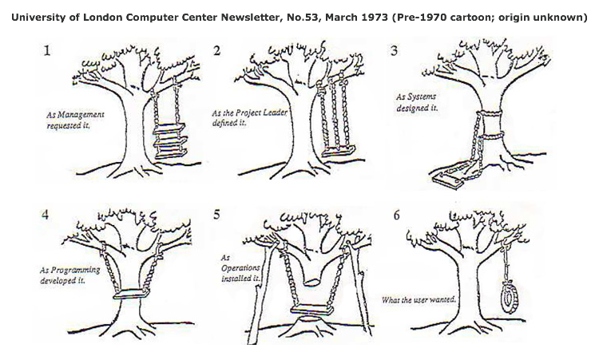

---

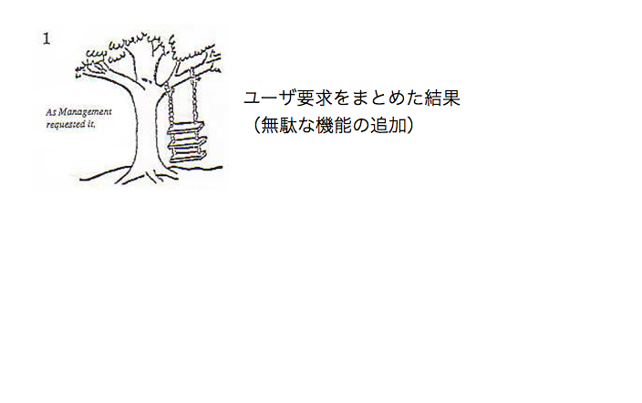

---
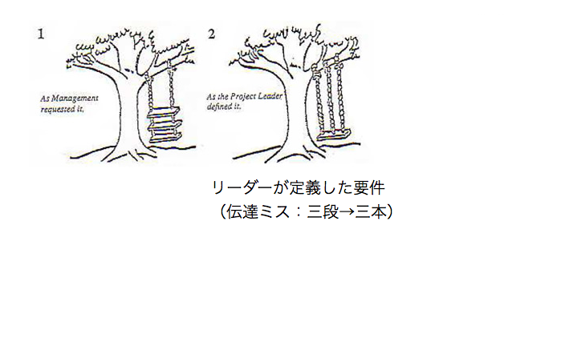

---
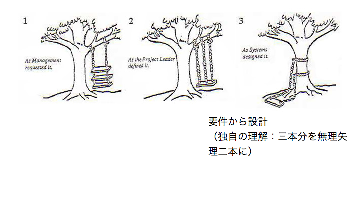

---
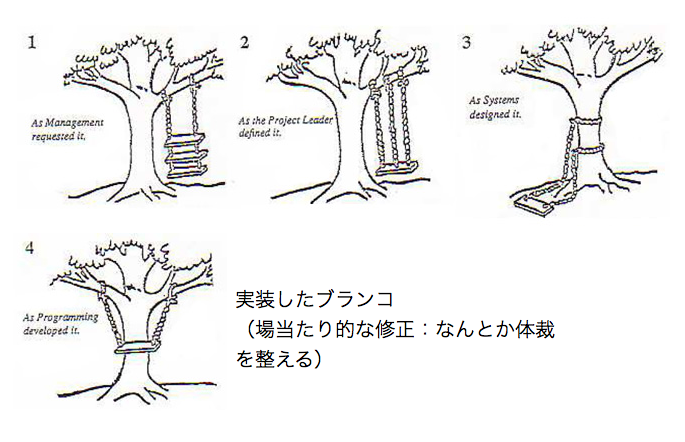

---
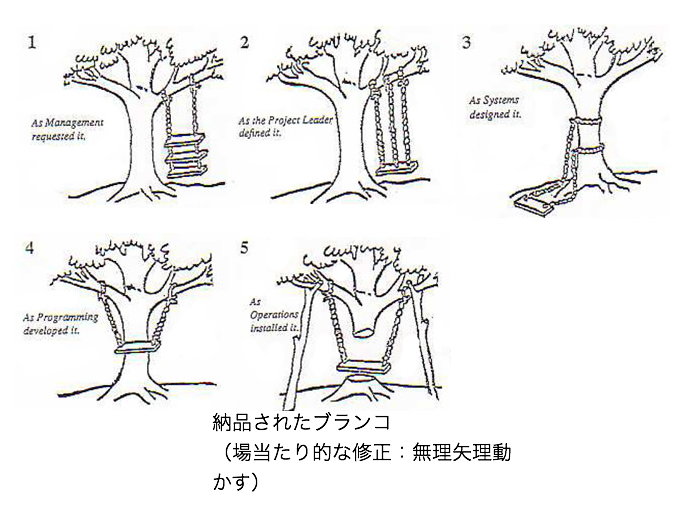

---
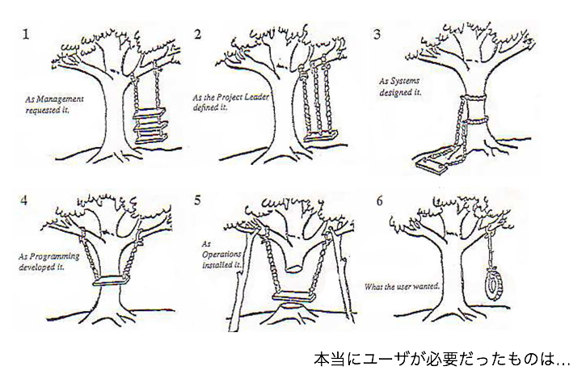

---

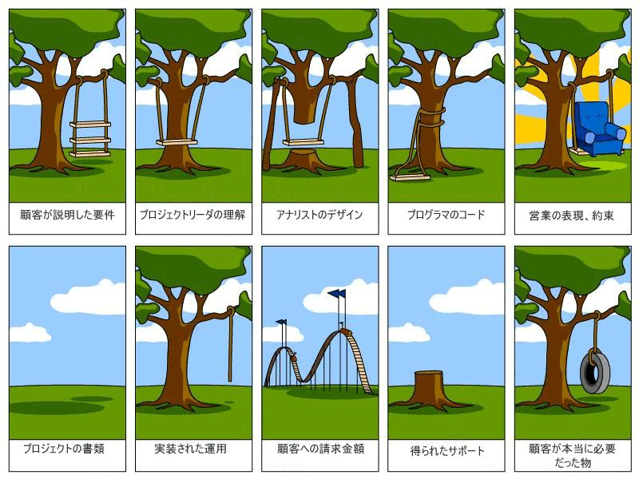

---

# ソフトウェア工学の範囲

### SWEBOK: Software Engineering Body of Knowledge

- システム／ソフトウェア要求
- システム／ソフトウェア設計
- システム／ソフトウェア構築
- システム／ソフトウェアテスティング
- システム／ソフトウェア保守
- システム／ソフトウェア構成管理
- システム／ソフトウェア開発マネジメント
- システム／ソフトウェア開発プロセス
- システム／ソフトウェア開発ツール・手法
- システム／ソフトウェア品質

---

# モダンな開発

- Frederick P. Brooks の分析（IBM OS/360 の開発者）
- OS/360 開発プロジェクトの失敗を経て分析<br>→結論：規模の大きなプログラムを作るのは難しい
	- 目に見えないものは管理できない（完成度が見えない）<br><span style="color: red;">→「動作」が見えるようにする（継続的インテグレーション）</span>
	- 変化させやすいものは管理が難しい（「これで最後」がない）<br><span style="color: red;">→変化を許容する（リファクタリング）</span>
	- 絶対的な制約のないものは管理が難しい（物理制約がない）<br><span style="color: red;">→最低限の制約を与える（テスト駆動）</span>

<!-- exercise ノートをまとめる https://www.microsoft.com/ja-jp/office/homeuse/scenario/onedrive07.aspx -->

---

# 第１週

## [ソフトウェア工学とは](#se11)
## [<span style="color: red;">ソフトウェア開発工程</span>](#se12)
## [ソフトウェア開発モデル](#se13)

---
<a name="se12"></a>
# ソフトウェアライフサイクル

- 誕生から廃棄に至るまでの一連のライフサイクル
- 次の工程（process）で構成される
	- 要求分析
	- 設計
	- 構築
	- テスト
	- 運用・保守

---

# 要求分析 (Requirements analysis)

## 目的

- ユーザの要求を満足するような仕様（specification）を決める．

## 要求の種類

- ビジネス要求：ビジネスプロセス・業務フローに対する要求
- システム要求：ビジネス要求を実現するシステムに対する要求
- プロセス要求：開発・保守作業に対する要求
- プロダクト要求：開発しようとするシステムそのものに対する要求
- 機能要求：システムが実行すべき機能に対する要求
- 非機能要求：システム品質（性質）に対する要求機能要求

---

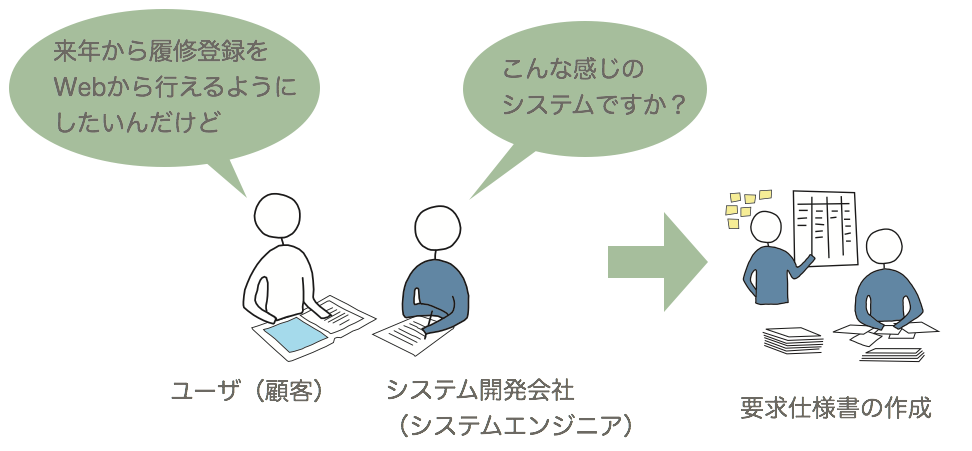

---

# 設計（Design）

## 目的

- ソフトウェアアーキテクチャ（architecture）や実装方法（implementation）を決める．

## 設計の種類

<small>（※開発手法によって呼び名やスコープが異なるので大まかに説明）</small>

- 外部／基本設計
	- ユーザに提供するインタフェースなどを決定する．
- 内部／詳細設計
	- システム内部の動きなどユーザから見ない部分の設計を行う．

---

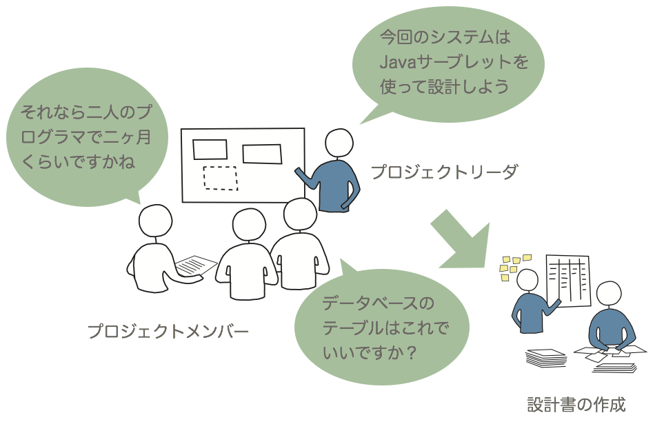

---

# 設計における二つの視点

## 構造視点（静的視点）：アーキテクチャ設計

- ソフトウェアがどういった部品（component）から構成されるか
- コンポーネントとそれらのインタフェースを決める
- ソフトウェアを分割して部分要素群を設計する（サブシステム分割，モジュール分割）

## 動作（behavior）視点（動的視点）

- ある処理を実現するためにコンポーネントがどのように動作するか
- コンポーネント間のやりとりを決める→大まかなプログラミング
- コンポーネント内の処理を決める→ほぼプログラミング

---

# ソフトウェア設計書

システムを複数の視点からみた文書・図面

## 構造視点

- UMLクラス図
- DFD (データフロー図）

## 動作視点

- フローチャート
- UMLユースケース図
- UMLシーケンス図
- UMLアクティビティ図

Exercise: 他のソフトウェア設計書について調べよ

---

# 構築（Construction）

## 目的

- 設計に沿ってコーディングを行う．
- プログラム品質／生産性の確保

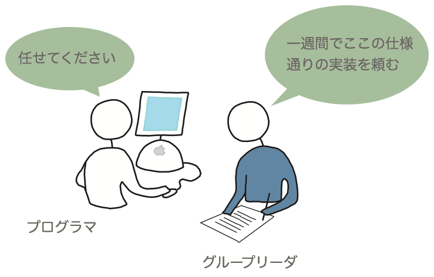

---

# コーディング規則

保守性と可読性の高いプログラム

- ネーミング（可読性の向上）
	- スネークケース（`get_value`）
	- キャメルケース（`getValue`）
	- ハンガリアン記法：接頭語による区別<br>`setXY(int xi, int yi)`
- スタイル（可読性の向上）
	- 括弧 `a == 1 || a == 2 && a == 3` <br> → `a == 1 || (a == 2 && a == 3)`
	- 字下げ（インデント）
- 禁止事項（保守性の向上）
	- グローバル変数，マクロ定義，etc.

---

# ツールの活用

- 統合開発環境 (IDE) : Eclipse, Visual Studio, etc.
	- コード補完（生産性向上），静的解析（エラーの指示）
- 開発（コンパイル）環境：make, ant, maven, gradle, etc.
- ドキュメント生成: JavaDoc, Doxygen, etc.

```java
...
  /**
    * Constructor
    * @param seed An integer as a seed
    * @param params An object of SFMTParams
    * which is a set of parameters for SFMT
    */
    public SFMT64(int seed, SFMTParams params) {
      ...
    }
...
```

<small>自動生成されたドキュメントの例：https://okamumu.github.io/JMTRandom/, https://okamumu.github.io/JMTRandom/javadoc/</small>

---

# テストを意識したコーディング

例：assertの活用

```c
#include <stdio.h>
#include <assert.h>

void sort(int n, int a[]) {
  /* n: ソートされる配列aの大きさ */
  assert(n > 0); /* n <= 0 は違反 */
  // 実装 ...
}

int main() {
  int a[] = {3, 4, 2, 4, 1, 3, 9};
  sort(0, a);
}
```

Exercise: コンパイル＆実行

---

# テスト（Testing）

## 目的

- プログラム／システムが要求通り動作するかどうか確認する

## テスト工程

- 単体テスト：単一モジュールの動作を確認する
- 結合テスト：複数のモジュールを結合して，モジュール間のインタフェースなどが要求通り動作するかどうか確認する
- システムテスト：実際の運用をシミュレートした環境で動作を確認する
- 受入テスト：システムを受け入れるかどうか決定するためのテスト

---

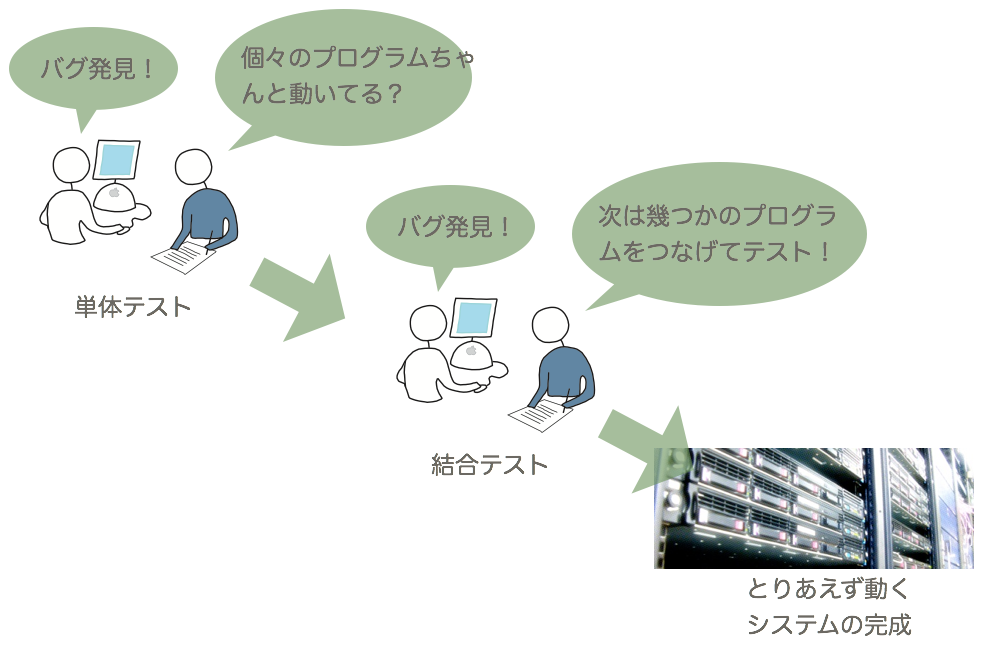

---

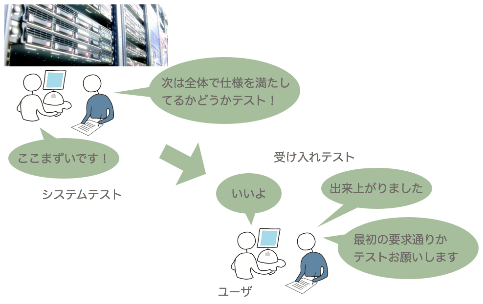

---

# テスト計画

- <span style="color: red;">構築前</span>に実施タイミング／基準／テストケースを決定


### テスト基準

- テストをいつやめるか
- 例：「全ステートメントを少なくとも１回は実行」，etc.

### テストケース

- テスト用データと確認事項のセット
- 例：`a = 1` を入力した時「2 が出力される」ことを確認

---

# テスト戦略（テストケースをどう作るか）
### ホワイトボックステスト
- プログラムに着目したテストケース作成
- 長所：基準が明確で誰にでもテストケース作成が可能
- 短所：テスト対象の規模が大きくなると適用不可能
- 例：カバレッジ基準によるテストケース作成<br>コードカバレッジ（C0），ブランチカバレッジ（C1）
### ブラックボックステスト
- 仕様に着目したテストケース作成
- 長所：テストケース数の減少
- 短所：効果的なテストケース作成に経験値が必要
- 例：同値分割，限界値分析

---

# 運用・保守

## 目的

- システムの起動・停止など管理オペレーション
- ソフトウェアの保証期間中のメンテナンス

## トピック

- バグ／問題管理
	- Bug/Issue トラッキングシステムの利用
- オンラインメンテナンス
	- パッチの配布
- 廃棄の計画

---

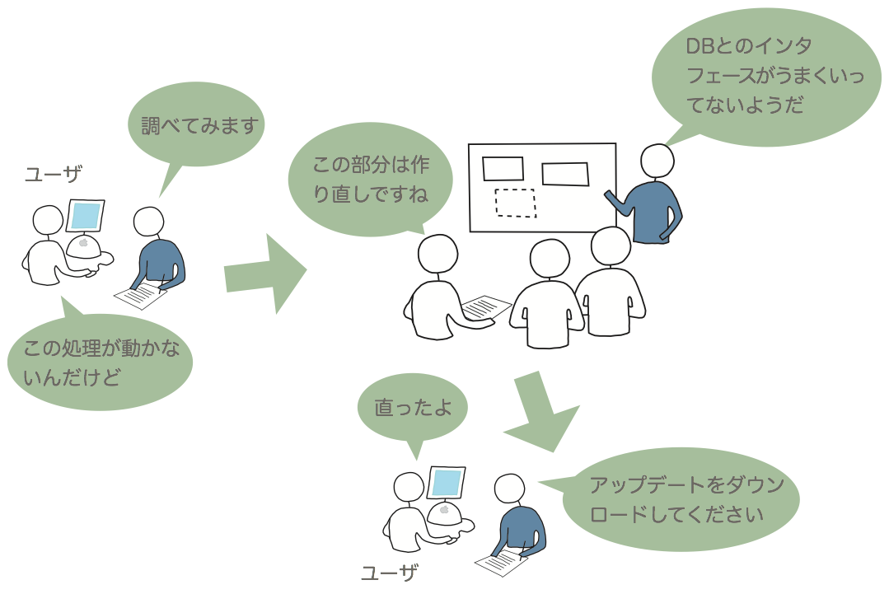

---

Exercise: 失敗事例

---

# 第１週

## [ソフトウェア工学とは](#se11)
## [ソフトウェア開発工程](#se12)
## [<span style="color: red;">ソフトウェア開発モデル</span>](#se13)

---
<a name="se13"></a>
# ソフトウェア開発モデル

- 典型的なソフトウェア開発に対する手順
- 最上位での開発手順
- 「料理」で考えると以下の手順はどんな料理でも大体同じ
	- 何を作るか決める
	- どうやって作るか決める
	- 食材を買いに行く
	- 作る
	- 食べる
	- 片付ける

---

- 「工程」と「プラクティス」（practice，慣行，ならわし）で構成

	- 工程（process，プロセス）：料理の例における「何を作るか考える」など
	- プラクティス：どうしたらうまく作れるか（料理を決める時に家族に聞く，買い物に行く前に広告をチェックする，など）

- 良い「プロセス」は良い「プロダクト」を作る
	- 典型的な「プロセス」を「モデル化」し，それぞれの段階で「するべきこと」をすると，良い「プロダクト」が作れる．

---

# ソフトウェア開発プロセスモデル

- ウォーターフォールモデル
- Ｖモデル
- プロトタイピング型開発
- スパイラルモデル
- インクリメンタル開発
- アジャイル（agile）開発
- etc.

---

# ウォーターフォールモデル

- 1970 年代に誕生
- 特徴
	-「工程」の考え方
	- 工程間の（小さな）フィードバック
- 工程
	- 要求分析：ユーザの要求からシステムの仕様を決める
	- 設計：仕様を満足するような構造や実装方法を決める
	- 構築：プログラムを作成する
	- テスト：設計や仕様通りに動作するかを確認する
	- 運用・保守：バグの修正や機能の追加する

---

- ドキュメント駆動プロセス
	- 各工程を完了して次の工程へ引き継ぐ
	- 工程間の引き継ぎはドキュメントで行う<br>（ドキュメントのレビューを行う）

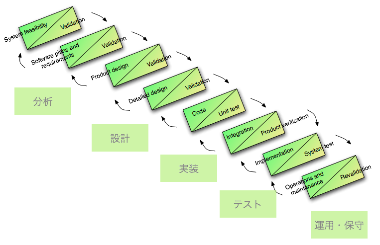

---

- V モデル
	- テストの段階を明示
	- 上流工程との対応付け

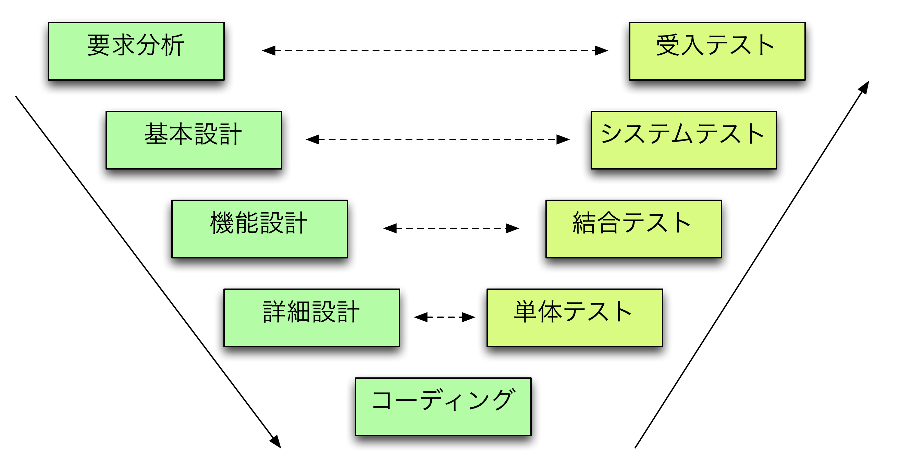

---

- 長所
	- 各工程で，マイルストーン（達成目標）と成果物（この場合は成果物＝ドキュメント）があるのでスケジュール管理が行いやすい
	- 分業が容易
- 短所
	- リスク管理が難しい
	- ソフトウェア開発には必ず「戻り工程」が存在する
- 対象例
	- 大規模で高い信頼性が要求されるシステム

---

# プロトタイピングモデル

- ウォーターフォールにおける「戻り工程」のリスクを低減
- 最終的に運用するソフトウェアシステムを作る前に，実験的なシステム（プロタイプ）を作る
- 特に，「要求分析」段階（フェーズ）で行うことが多い
- どの程度の「プロトタイプ」を作成するかが難しい（短所）

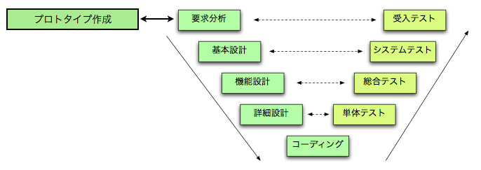

---
# インクリメンタル開発

- 小さな機能範囲のシステムから作成
- 改良（バージョンアップ）によるシステム構築
- 典型的には「確実に必要な機能」から作成していく<br>（プロトタイピングは「不確実な機能を明らかにする」）
- 設計が貧弱になりコードのメンテナンス性が悪くなる（短所）のでリファクタリング（再構築）が必要になる場合がある

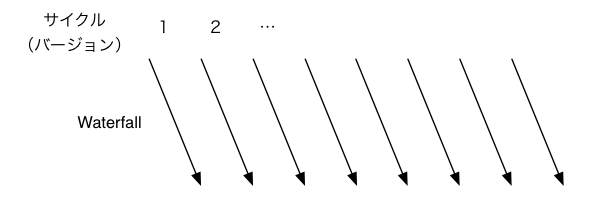

---

# 課題（再掲）

### note_week1.docx または note_week1.md をグループで分担して作成して Bb9 を通じて提出せよ．

- OneDriveを利用したOfficeの共同編集 https://www.microsoft.com/ja-jp/office/homeuse/scenario/onedrive07.aspx
- Marp: Markdown presentation writer (https://yhatt.github.io/marp/)


---

# ふりかえり

- 今週のグループでの共同作業をふりかって，良かった点，悪かった点を議論する．
- 次回に向けて KPT を作っておく
	- K (Keep): 次回も続けること（良かったこと）
	- P (Problem): 今回問題となったこと（悪かったこと）
	- T (Try): 問題を解決するために次回自分たちがチャレンジすること
